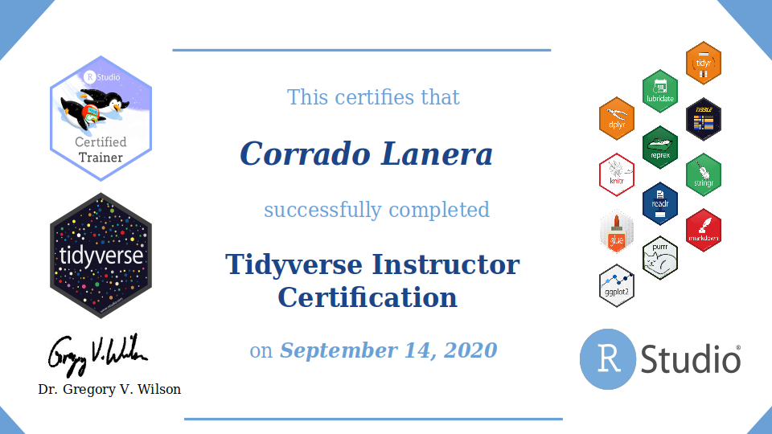
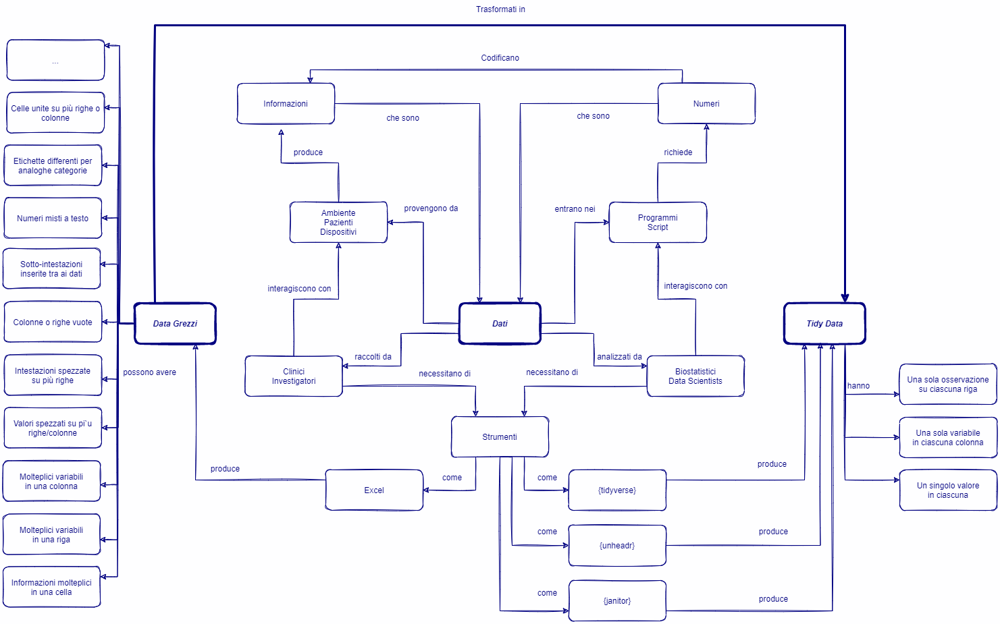

```{r setup, include=FALSE}
knitr::opts_chunk$set(echo = FALSE)
```

```{r xaringanExtra, echo=FALSE}
xaringanExtra::use_xaringan_extra(c(
    "panelset", "clipboard"
))
```

## Chi sono _io_

```{r}
knitr::include_graphics("images/profilo_CL.jpg")
```

Piacere! Sono Corrado Lanera, un appassionato di [`r fontawesome::fa("r-project", fill = "orange")`](https://www.r-project.org) e data scientist dal 2014, _seguace_ del [Tidyverse](https://www.tidyverse.org/) fin dal suo esordio  `r emo::ji("star-struck")`. Attualmente, sono un post-doc presso [UBEP](http://www.unipd-ubep.it) (Unità di Biostatistica, Epidemiologia e Salute Pubblica) dell'[Università di Padova](https://www.unipd.it/). Lì, la mia attività di ricerca è principalmente diretta nell'area del machine learning e delle tecniche di phenomapping applicate a contesti clinici, con particolare attenzione alle analisi di dati di testo in linguaggio naturale e dati non strutturati per la classificazione automatica di:

- outcome clinici
- articoli scientifici per revisioni sistematiche
- segnali cinetici di dispositivi indossabili


Per la nostra unità, gestisco i server [RStudio Server Pro](https://www.rstudio.com/products/rstudio/#rstudio-server) e [Shiny Server](https://www.rstudio.com/products/shiny/shiny-server/) per lo sviluppo e la distribuzione dei risultati, dei servizi e delle applicazioni che offriamo come unità.

Amo promuovere, insegnare ed essere un esempio di come creare codice ([`r fontawesome::fa("r-project", fill = "red")`](https://www.r-project.org), ma non solo) leggibile, riproducibile e sopratutto robusto. Recentemente sono stato certificato come un [_RStudio Trainer_](https://education.rstudio.com/trainers/people/lanera+corrado/) per il [Tidyverse](https://www.tidyverse.org/).

<aside>
```{r}

```
</aside>


## Chi sei _tu_

### Prerequisiti

Il corso è principalmente indirizzato a operatori della ricerca clinica, ovvero persone con esperienza lavorativa nell'ambito della ricerca clinica o laureati che hanno seguito un corso di alta formazione in ricerca clinica. Se non hai alcuna esperienza di ricerca clinica, e di come (anche sommariamente) possono essere fatti i dati di cui si occupa, è possibile che il corso ti dia degli strumenti che potrebbero non esserti direttamente utili.

Il corso sarà svolto scrivendo, eseguendo e sfruttando codice [`r fontawesome::fa("r-project", fill = "grey")`](https://www.r-project.org), presuppongo quindi che tu riesca a capirlo e abbia scritto del codice o delle analisi con tale linguaggio: per quanto introdurremo pacchetti e funzioni, non è tra gli obiettivi insegnarti il linguaggio base, il quale lo considererò come un prerequisito noto.


Non avendoti mai visto, nel preparare la lezione ho immaginato tu potessi essere una tra le seguenti persone.


### Carla Clinica

In breve, Carla è un'intensivista cardiotoracica appassionata e informata di ricerca clinica, interessata a fare ricerca in autonomia conducendo da sé le analisi sui dati dei suoi studi e del suo reparto. Usa Excel per raccogliere i dati dei pazienti assieme ad alcuni dei suoi colleghi; per le analisi ha iniziato a usare R e vorrebbe capire come sfruttarlo al meglio.


::::: {.panelset}

::: {.panel}

#### Background {.panel-name}

Carla ha passato gli ultimi 6 anni a lavorare nell'unità di terapia intensiva cardiotoracica in un grande sistema ospedaliero. Ha letto molti articoli entusiasmanti sul _data science_, ed è entusiasta della prospettiva di imparare a farlo anche lei! Purtroppo, trova molta difficoltà a usare gli strumenti come R quando si tratta di applicarli al mondo reale fuori dai corsi.

Carla è sempre stata una brava studentessa e ha sempre eccelso nelle cose che ha cercato di imparare. Quando si impegna a imparare qualcosa di nuovo è molto dura con se stessa e preferirebbe dare la colpa alle lunghe ore di lavoro piuttosto che far sapere ai suoi colleghi che potrebbe servirle aiuto.

:::

::: {.panel}

#### Competenze {.panel-name}

Ambito | Statistica | Programmazione | `r fontawesome::fa("r-project", fill = "brown")`
-------|------------|----------------|------------
Esperta^[Per sapere cosa rappresenta per me ciascuna _classe di competenza_ puoi fare riferimento a [queste note](https://www.rebeccawestburns.com/my-blog-3/notes/five-stages-of-acquiring-expertise-novice-to-expert) di [Rebecca West Burns](https://www.rebeccawestburns.com) (in inglese).] | Competente     | Competente         | Competente


Carla si tiene al passo con la ricerca medica, ma ha poca esperienza nel farla. Usa Excel sia per compiti non legati ai dati (ad esempio, fare liste), che per inserire manualmente i dati dei pazienti in fogli di calcolo per la revisione delle cartelle. Sta studiando R da quasi un anno perché vuole essere in grado di gestire e analizzare i sui dati in modo efficiente: ormai non la spaventa più qualche riga di codice ed è entusiasta di pensare che presto potrà sentirsi autonoma per le sue analisi e i propri studi.


:::

::: {.panel}

#### Esigenze {.panel-name}

Carla predilige tutorial autodidattici con esercizi pratici, e forum dove può chiedere aiuto. Ha bisogno di brevi panoramiche per orientarsi e di tutorial introduttivi che includano video (o GIF animate) che mostrino esattamente come usare gli strumenti che studia, e che utilizzino basi di dati a cui possa far riferimento. 

A Carla piacerebbe avere una comunità di altre persone nel campo medico che sono interessate a imparare come lavorare sui dati, in modo da poter imparare e fare domande in un gruppo cooperativo.

:::

::: {.panel}

#### Extra {.panel-name}

Carla è un genitore single che si destreggia tra il tempo al lavoro e a casa ed è quindi sempre a corto di tempo per imparare nuove abilità, anche tra quelle che le interessano e la appassionano.

:::


:::::


### Peter Programmer

Peter è un ragazzo giovane, neolaureato, con poca disponibilità economica ma tanta competenza informatica e passione per la ricerca clinica. Non gli piace, e non vuole, perdere tempo in chiacchiere né in cose non direttamente applicabili. Sta formando una rete di collaborazioni con clinici e biostatistici per poter a breve vivere facendo analisi e collaborando in progetti di ricerca clinica. Ha ancora diversi problemi comunicativi con il mondo clinico, sopratutto nel capire perché raccolgono i dati in un modo tanto bizzarro e difficile da utilizzare.


::::: {.panelset}

::: {.panel}

#### Background {.panel-name}

Peter si è da poco laureato in statistica ma è sempre stato appassionato di ricerca clinica, e infatti, sta seguendo da quasi un anno ormai un corso in materia. Appassionato di computer, conosce e sa programmare piuttosto bene in diversi linguaggi come Python ed R. Spesso si sente molto frustrato quando fa analisi per qualche amico ospedaliero, i quali sembra facciano apposta a raccogliere i dati con lo scopo preciso di rendergli la vita impossibile.

Peter è una persona che divaga, esplora, e cerca di approfondire i temi che di volta in volta lo appassionano. Nonostante questo, al computer è estremamente rigoroso. Predilige corsi on-line piuttosto che in presenza, trovando questi ultimi spesso molto dispersivi. Tra l'altro, apprezza molto la possibilità di rivedere più volte, anche come ripasso, le lezioni che segue.


:::

::: {.panel}

#### Competenze {.panel-name}

Ambito     | Statistica | Programmazione | `r fontawesome::fa("r-project", fill = "ocra")`
-----------|------------|----------------|------------
Competente | Competente | Esperto        | Esperto


Oltre allo studio, Peter sta imparando a fare ricerca clinica principalmente sul campo informatico, occupandosi delle analisi dei dati che gli danno i suoi amici clinici. Usa R e Python con disinvoltura, ma li ha sempre usati per scrivere software o applicazioni piuttosto che fare analisi di dati. Ha studiato ha delle basi di statistica descrittiva e inferenziale e sta approfondendo argomenti più avanzati come la validazione dei modelli o il machine learning. Comunque non riesce ancora a dare un senso clinico "culturale" e "pieno" alle analisi che fa, e comunicare ai clinici sia i risultati che ottiene sia le sue esigenze è sempre molto difficile. Si trova spesso a chiedere aiuto a qualche su ex collega di università, già nel mondo della biostatistica, per consigli su come processare i dati che ha per prepararli alle analisi che vuole condurre.


:::

::: {.panel}

#### Esigenze {.panel-name}

Peter vuole andare al sodo senza perdere tempo, ha bisogno di imparare e farlo in fretta. Segue corsi on-line con esercizi guidati e corretti per fare pratica nel modo più efficiente e rapido possibile, oltre che per avere dei template da riprendere per le sue analisi.

Conoscere altri biostatistici e clinici gli farebbe molto piacere per continuare a formare la rete di conoscenze che gli possa permettere, con le sue abilità, di lavorare con soddisfazione nell'ambito della ricerca clinica.

:::

::: {.panel}

#### Extra {.panel-name}

Peter sta cercando di lavorare con la ricerca clinica e al momento non ha molti soldi, investirli in corsi per lui è molto importante ma un gran sacrificio. La cosa spesso lo distrae molto quando comincia a pensare che quanto sta facendo non avrà un riscontro pratico concreto per lui.

:::


:::::


## Che cosa faremo


### Obiettivi del corso

1. **Rivedere** 
  - le principali tipologie di dati utilizzati nella ricerca clinica
  - le caratteristiche che possono avere file di dati clinici
  - i tipi di dati usati da R
  - le caratteristiche strutturali utili delle basi di dati da analizzare
  - principi, consigli, e strumenti base per analisi riproducibili
  

2. **Imparare a** 
  - Importare in R file di basi di dati rettangolari (es. CSV o Excel)
  - Manipolare dati di tipo testuale (espressioni regolari)
  - Gestire problematiche strutturali di importazione (es. intestazioni/valori su più righe, sottotitoli di raggruppamento nei dati, o campi reputi implicitamente)
  - Trasmutare dati grezzi in _tidy-data_ (es. separando valori, o _ruotantoli_ in lungo e in largo)
  - Estrarre e convertire valori numerici misti o dentro a testo

3. **Esplorare e ottenere una panoramica dei pacchetti R** 
  - `{readr}` (e `{readxl}`) per importare i dati
  - `{janitor}` per uniformare i metadati principali di una base di dati  e rimuovere righe/colonne prive di contenuto
  - `{tidyr}` e `{dplyr}` per la manipolazione di basi di dati rispettivamente globalmente e puntualmente
  - `{stringr}`, e le espressioni regolari, per la gestione di informazioni testuali
  - `{unheadr}` per risolvere i problemi comuni di importazione da fogli di calcolo


### In parole povere...

Imparerai a importare correttamente una base di dati dal mondo esterno dividendo, aggregando, estraendo, trasformando, lei stessa o il suo contenuto fino ad arrivare a forma, struttura, coerenza e completezza utili per le tue analisi; il tutto, operando solo tramite codice (R), riproducibile e senza alcuna manipolazione diretta del contenuto del file sorgente (Excel/csv) da parte tua!

<aside>
La responsabilità di manipolare il file sorgente originale dovrebbe essere sempre esclusiva e responsabilità di chi fornisce i dati, non di chi li deve analizzare.
</aside>

## Mappa concettuale

```{r, layout="l-body-outset"}

```
