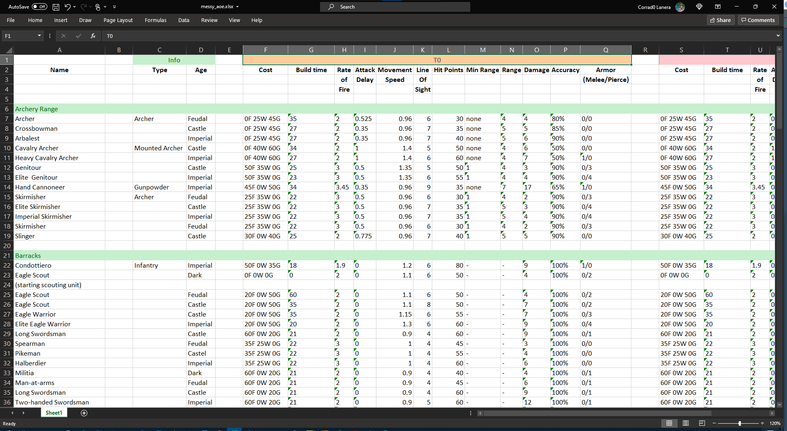

name: title
class: center, middle
background-image: url(http://bit.ly/arm-greens)
background-size: cover

# Data Cleaning per la Ricerca Clinica


### Con esempi in `r fontawesome::fa("r-project", fill = "blue")`

.large[.white[
  Corrado Lanera | Clinical Research Academy | 13 ottobre 2021
  
  https://cra-datacleaning.netlify.app/
]]


```{r setup, include=FALSE}
knitr::opts_chunk$set(
  fig.retina = 3,
  warning = FALSE,
  message = FALSE,
  comment = ""
)
```

```{r xaringan-themer, include=FALSE, warning=FALSE}
library(xaringanthemer)
red <- "#f34213"
purple <- "#3e2f5b"
orange <- "#ff8811"
green <- "#136f63"
white <- "#FFFFFF"

pastel_orange <- "#F97B64"
blu_gray <- "#1F4257"

style_duo_accent(
    # primary_color = pastel_orange
    # secondary_color = purple,
    # colors = c(
    #     red = red,
    #     purple = purple,
    #     orange = orange,
    #     green = green,
    #     white = white,
    #     pastel_orange = pastel_orange,
    #     blu_gray = blu_gray
    # )
)
```

```{r xaringanExtra, include=FALSE}
xaringanExtra::use_xaringan_extra(c(
  "tileview",
  "animate_css",
  "tachyons",
  "editable",
  "panelset",
  "webcam",
  "clipboard",
  "freezeframe",
  "share_again"
))
```

```{r countdown, echo = FALSE, include = FALSE}
library(countdown)
# countdown(minutes = 0, seconds = 15)
```

---

name: whoami
class: inverse, bottom, right


```{r, echo=FALSE, out.width = "40%"}

```

# Dove trovarmi...


<br>


[`r fontawesome::fa("link")`](https://www.CorradoLanera.it) [**www.CorradoLanera.it**](https://www.CorradoLanera.it)

[`r fontawesome::fa("mail-bulk")`](mailto:Corrado.Lanera@ubep.unipd.it) [**Corrado.Lanera@ubep.unipd.it**](mailto:Corrado.Lanera@ubep.unipd.it)

[`r fontawesome::fa("mail-bulk")`](mailto:Corrado.Lanera@gmail.com) [**Corrado.Lanera@gmail.com**](mailto:Corrado.Lanera@gmail.com)

[`r fontawesome::fa("github")`](https://github.com/corradolanera)
[`r fontawesome::fa("twitter")`](https://twitter.com/corradolanera)
[`r fontawesome::fa("telegram-plane")`](https://telegram.me/CorradoLanera)
@CorradoLanera

[`r fontawesome::fa("telegram-plane")`](https://telegram.me/puffrbacco)
[puffRbacco](https://telegram.me/puffrbacco)

[`r fontawesome::fa("calendar-check")` ](https://calendly.com/corradolanera) [calendly.com/corradolanera](https://calendly.com/corradolanera)

<br>


---
name: intro-what
class: inverse, middle, center

# Introduzione

### Cosa vedremo


---
name: motivation-1

## Data cleaning per la ricerca clinica


> Un generico processo capace di garantire, con una certa soglia di affidabilità, la correttezza di una grande quantità di dati. [...] tale procedimento precede l'effettiva estrazione [...] di quantità di informazione potenzialmente utile [...] al fine di produrre conoscenza.

.right[.small[
  [https://it.wikipedia.org/wiki/Data_cleaning](https://it.wikipedia.org/wiki/Data_cleaning)
]]

<br>
<br>

--

- **processo**: oggetto --> _tecniche_ --> oggetto (**trasformato**).

--

- **affidabilità**: garanzia di **riproducibilità**

--

- **correttezza**: risultato (e tecniche) **testate**

--

- **precede la produzione di consocenza** --> analisi **direttamente eseguibili**


---
name: motivation-1-bis

## Data cleaning (per la ricerca clinica)


> Un generico processo capace di garantire, con una certa soglia di affidabilità, la correttezza di una grande quantità di dati. [...] tale procedimento precede l'effettiva estrazione [...] di quantità di informazione potenzialmente utile [...] al fine di produrre conoscenza.

.right[.small[
  [https://it.wikipedia.org/wiki/Data_cleaning](https://it.wikipedia.org/wiki/Data_cleaning)
]]

<br>
<br>

- **processo**: oggetto --> _tecniche_ --> oggetto (**trasformato**).

- **affidabilità**: garanzia di **riproducibilità**

- ~~**correttezza**: risultato (e tecniche) **testate**~~ .footnote[1: Servirebbe un corso a sé, per oggi ci limiteremo a "vedere" che i risultati sono _giusti_.]

- **precede la produzione di consocenza** --> analisi **direttamente eseguibili**


---
name: motivation-2

## (Data cleaning per la) ricerca clinica


> La ricerca clinica è una branca della scienza sanitaria che determina la sicurezza e l'efficacia di farmaci, dispositivi, prodotti diagnostici e regimi di trattamento destinati all'uso umano. [...] nella ricerca clinica si raccolgono prove [...]. 

.right[.small[
  [https://en.wikipedia.org/wiki/Clinical_research](https://en.wikipedia.org/wiki/Clinical_research) <br> ... tradotto in italiano con [www.DeepL.com/Translator](www.DeepL.com/Translator) (versione gratuita)
]]


--

- **farmaci, dispositivi, prodotti, trattamenti**: tipologie **molteplici** di dati

--

- **raccolta**: ottimizzazione **non per l'utilizzo**!

---
name: motivation-3

## Data cleaning per la ricerca clinica

```{r, echo=FALSE, out.width = "100%"}

```

> Dataset modificato, rispetto all'originale `data("AOEunits_raw", package = "unheadr")`, per enfatizzare ulteriori problematiche comuni in fogli di raccolta dati clinici.

---
name: r

## Perché `r fontawesome::fa("r-project", fill = "blue")`


- Garantisce la **`r fontawesome::fa("r-project", fill = "red")`iproducibilità**

- Ampiamente diffuso tra gli operatori della **`r fontawesome::fa("r-project", fill = "green")`icerca** (clinica)

- **Espanso** e **ve`r fontawesome::fa("r-project", fill = "brown")`ificato** in modo **comunita`r fontawesome::fa("r-project", fill = "orange")`io**

- È **g`r fontawesome::fa("r-project", fill = "pink")`atis** e **ape`r fontawesome::fa("r-project", fill = "purple")`to**!


```{r, echo=FALSE, out.width = "100%", fig.cap="Figure from https://github.com/allisonhorst/stats-illustrations"}
knitr::include_graphics("https://github.com/allisonhorst/stats-illustrations/raw/master/rstats-artwork/monster_support.jpg")
```
<br>


---
name: intro-how
class: inverse, middle, center

# Introduzione

### Materiale


---
name: website

# Course Website


```{r, echo=FALSE, out.width = "100%", fig.cap='<a href="https://cra-datacleaning.netlify.app/">https://cra-datacleaning.netlify.app/</a>'}
knitr::include_url("https://cra-datacleaning.netlify.app/")
```

---
name: rscloud

# RStudio Cloud

[https://bit.ly/datacleaning-cra](https://bit.ly/datacleaning-cra)


---
name: outline

## Programma

 **Ora** | **Tema**
--------:|:-------------------------------
  14:00  | _Benvenuti_ dall'organizzazione e [Sondaggio pre-corso](https://forms.gle/iWBP75A2SJTFY3Ju9)
  14:10  | Introduzione, motivazione, presentazione caso studio
  14:20  | Importazione dati dall'esterno e primi accorgimenti
  14:30  | Manipolazione di stringhe: le espressioni regolari
  14:40  | Problemi nelle intestazioni
  14:50  | Problemi nei valori
  15:00  | **COFFEE BREAK**
  15:10  | Sotto-intestazioni (raggruppamenti) tra i valori
  15:20  | Riempimento, separazione, espansione, e contrazione
  15:30  | Numeri e finalizzazione
  15:40  | Domande, dubbi, curiosità
  16:00  | [Sondaggio post-corso](https://forms.gle/uRJ8yYwZ6YzweSKa8)
  16:10  | **FINE**
  


---
name: intro-next
class: inverse, middle, center

# Introduzione

### Fine

### Prossimo argomento: [importare dati in `r fontawesome::fa("r-project", fill = "purple")`](02-importazione.html) 
