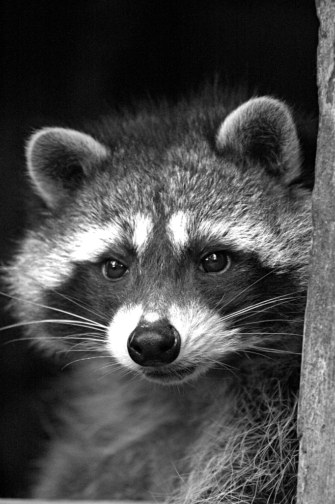

```{r setup, include=FALSE}
knitr::opts_chunk$set(echo = FALSE)
```

```{r meta, echo=FALSE}
library(metathis)
meta() %>%
  meta_general(
    description = "Un (per)corso panoramico sulle sfide a un'importazione corretta di dati clinici in un sistema informatico, con esempi e soluzioni in R.",
    generator = "xaringan and remark.js"
  ) %>% 
  meta_name("github-repo" = "CorradoLanera/cra.datacleaning") %>% 
  meta_viewport() %>% 
  meta_social(
    title = "Data Cleaning per la Ricerca Clinica",
    url = "https://cra-datacleaning.netlify.app/",
    image = "https://upload.wikimedia.org/wikipedia/commons/thumb/1/11/Procyon_lotor%28Gollibolli%291.JPG/2560px-Procyon_lotor%28Gollibolli%291.JPG",
    image_alt = "Procyon lotor by Matthias Barby",
    og_type = "website",
    twitter_card_type = "summary_large_image",
    twitter_creator = "@CorradoLanera"
  )
```

```{r xaringanExtra, echo=FALSE}
xaringanExtra::use_xaringan_extra(c(
    "panelset", "clipboard"
))
```

```{r fig.cap="Figure from https://commons.wikimedia.org/wiki/File:Procyon_lotor(Gollibolli)1.JPG", out.extra="class=external", layout="l-body-outset"}
knitr::include_graphics("images/2560px-Procyon_lotor(Gollibolli)1.JPG")
```


## Informazioni generali

Grazie per aver deciso di partecipare a questo breve corso di un paio d'ore sul _data cleaning_! Di seguito trovi il materiale utilizzato da me, Corrado Lanera, per il suo svolgimento nel contesto dei corsi offerti gratuitamente per tutti da [FormazioneNelFarmaceutico](https://formazionenelfarmaceutico.com/) e inseriti nel contesto del loro percorso formativo [Clinical Research Accademy](https://formazionenelfarmaceutico.com/courses/category/Clinical%20Research%20Academy).

<aside>Il corso e tutto il materiale sono in lingua italiana.</aside>

Il corso sarà incentrato nell'introdurti le principali sfide, e le corrispondenti soluzioni (con esempi pratici in `r fontawesome::fa("r-project", fill = "red")`), per una corretta e fedele importazione di dati da analizzare dal mondo esterno.

Introdurrò le principali problematiche in cui ti potresti imbattere importando dati clinici (a partire da _come_ ci vengono forniti, fino alla gestione della corretta tipologia di dato), analizzandone le cause, i possibili effetti indesiderati che si potrebbero verificare nel caso in cui tali problematiche non venissero gestite. Infine proporrò metodi pratici, sviluppati in `r fontawesome::fa("r-project", fill = "green")`, per poterli gestire al meglio.

Partecipando al corso, sarai quindi in grado di individuare e affrontare le principali caratteristiche e problematiche legate al _data cleaning_, in particolare nell'ambito della ricerca clinica. Verrai inoltre a conoscenza delle principali funzionalità rilevanti, per il _data cleaning_, tra quelle offerte dai pacchetti `r fontawesome::fa("r-project", fill = "pink")`: 
[`{dplyr}`](https://dplyr.tidyverse.org/), [`{janitor}`](https://garthtarr.github.io/meatR/janitor.html), [`{readr}`](https://readr.tidyverse.org/), [`{readxl}`](https://readxl.tidyverse.org/) [`{stringr}`](https://stringr.tidyverse.org/), [`{tidyr}`](https://tidyr.tidyverse.org/), e [`{unheadr}`](https://unheadr.liomys.mx/).

Il corso è pensato con un livello di interazione piuttosto ridotto. Per quanto questo sia certamente un limite, ci permetterà di poterlo registrare a beneficio futuro di quanti non avessero potuto partecipare in diretta. A garanzia della protezione della privacy di tutti i partecipanti, non potrai attivare la tua webcam né il microfono. La possibilità di porre (e rispondere a) domande in modo scritto e mediato ti sarà comunque garantita.


### Dove `r emo::ji("pushpin")`


+ **Dal vivo**: meeting [GoToWebinar](https://attendee.gotowebinar.com/register/3102460492127285776). Per ottenre il certificato di partecipazione, registrati tramite [questa pagina](https://formazionenelfarmaceutico.com/p/data-cleaning-per-la-ricerca-clinica/).

+ **Video del corso**: accessibile dalla piattaforma [FormazioneNelFarmaceutico](https://formazionenelfarmaceutico.com/) previo registrazione a [questa pagina](https://formazionenelfarmaceutico.com/p/data-cleaning-per-la-ricerca-clinica/)


### Quando `r emo::ji("clock")`

+ **Dal vivo**: 13 Ottobre 2021 | 14:30--16:30 CEST/UTC+2

+ **Video del corso**: A seguire (dopo i necessari _tempi tecnici_ per la messa on-line).

<aside>
Se non sei in Italia, verifica [l'orario del corso nella tua zona](https://www.timeanddate.com/worldclock/meetingdetails.html?year=2021&month=10&day=13&hour=12&min=30&sec=0&p1=215).
</aside>


### Quanto `r emo::ji("money_mouth_face")`

Per la partecipazione al corso dal vivo, così come per la visione della sua registrazione in futuro, è richiesto che tu [ti registri](https://formazionenelfarmaceutico.com/p/data-cleaning-per-la-ricerca-clinica/) (adesso o in futuro) al workshop. La registrazione, sia per partecipare al corso sia per poter accedere alla sua registrazione, è offerta gratuitamente a chiunque da [FormazioneNelFarmaceutico](https://formazionenelfarmaceutico.com/).

\

## Codice di Condotta

Tutti coloro che partecipano alle attività legate a questo corso (inclusi, ma non limitatamente a, gli organizzatori, gli istruttori, e i partecipanti) sono tenuti a rispettare il [Codice di Condotta](code_of_conduct.html). Questo documento descrive anche come segnalare un incidente, se necessario.


\

## Operazioni Preliminari

### Essenziali

+ La piattaforma utilizzata per il corso sarà [GoToWebinar](https://www.goto.com/it/webinar), assicurati per tempo che i tuoi computer, software e connessione soddisfino i [requisiti minimi di sistema](https://support.goto.com/it/webinar#Standard) per poter partecipare col minimo rischio di intoppi.


### Opzionali

Per (e)seguire gli esempi e gli esercizi proposti localmente sul computer che utilizzerai, ti consiglio di aver installato in anticipo i seguenti software:

* Una versione recente di `r fontawesome::fa("r-project", fill = "purple")` (>=4.0.0), scaricabile gratuitamente da <https://cran.r-project.org/>

* Una versione recente di RStudio (>=1.4.0), scaricabile gratuitamente da <https://www.rstudio.com/download> (Licenza Open Source di RStudio Desktop)

* I pacchetti che utilizzeremo saranno quelli riportati di seguito, i quali possono essere installati, collegandosi a internet, aprendo RStudio, ed eseguendo la seguente riga di codice nella console:
  
  ``` r
  install.packages(c(
    "here", "janitor", "tidyverse", "unheadr", "usethis"
  ))
  ```
* Dal giorno del corso in poi, i dati, le slide e le soluzioni degli esercizi potrai recuperarli tramite l'esecuzione del seguente codice:

  ``` r
  usethis::use_course("CorradoLanera/cra.datacleaning/web/esercizi",
                      destdir = "<tuo path di progetto del corso>")
  ```


<aside>
Il giorno del corso, attiverò un [link](#rs-cloud) a un progetto [RStudio Cloud](https://rstudio.cloud/) che conterrà tutto il materiale utile per il corso, oltre ad avere già installati tutti i pacchetti che useremo. Se tu preferissi (e)seguire gli esempi su tale piattaforma remota, invece che su un _tuo_ computer, è necessario (ma sufficiente) che tu abbia un account su [RStudio Cloud](https://rstudio.cloud/); se già non ce l'hai, puoi crearlo gratuitamente su <https://rstudio.cloud/>.
</aside>


\

## Programma

 **Ora** | **Tema**
--------:|:-------------------------------
  14:00  | _Benvenuti_ dall'organizzazione e [Sondaggio pre-corso](https://forms.gle/iWBP75A2SJTFY3Ju9)
  14:10  | Introduzione, motivazione, presentazione caso studio
  14:20  | Importazione dati dall'esterno e primi accorgimenti
  14:30  | Manipolazione di stringhe: le espressioni regolari
  14:40  | Problemi nelle intestazioni
  14:50  | **COFFEE BREAK**
  15:00  | Problemi nei valori
  15:10  | Sotto-intestazioni (raggruppamenti) tra i valori
  15:20  | Riempimento, separazione, allungamento, e contrazione
  15:40  | Domande, dubbi, curiosità
  16:00  | [Sondaggio post-corso](https://forms.gle/uRJ8yYwZ6YzweSKa8)
  16:10  | **FINE**
  

\

### Sondaggi

Ti chiederei di completare i seguenti sondaggi: uno prima dell'inizio del corso (dopo esserti iscritto) e l'altro al termine del corso.

Il primo sondaggio mi servirà principalmente per conoscere meglio le tue esigenze specifiche, e poter eliminare quindi dalla lezione tutto quanto conosci già molto bene, così da non farti perdere tempo né annoiarti con cose che non ti interessano e magari conosci anche meglio di me `r emo::ji("winking_face_with_tongue")`. Inoltre, mi permetterà di dare più attenzione alle parti che ti potranno essere davvero utili per migliorare, sfruttando al meglio il tempo che avremo a disposizione `r emo::ji("flexed_biceps")`.

<aside>
Il sondaggio pre-corso **non** è un esame per capire se hai le competenze per seguire il corso. Non preoccuparti se non sai rispondere ad alcune domande: è previsto! Anzi, se rispondi a tutto... `r emo::ji("winking_face")`
</aside>

+ [Sondaggio pre-corso](https://forms.gle/iWBP75A2SJTFY3Ju9)


Il secondo sondaggio mi servirà per capire quanto sono stato efficace con la lezione che avrò tenuto, permettendomi di migliorare i corsi che potrò tenere in futuro. Potrà anche essere utile a te come ripasso di quanto abbiamo fatto.


<aside>
Nemmeno il sondaggio post-corso è un esame, anzi: le tue risposte mi saranno _solo_ utilissime a capire in quali punti ho il maggior margine per migliorare la le mie future lezioni.
</aside>

+ [Sondaggio post-corso](https://forms.gle/uRJ8yYwZ6YzweSKa8)


\


**Ti aspetto al corso _Data Cleaning per la Ricerca Clinica_!!** `r emo::ji("popper")`


**Corrado.**

```{r fig.cap="Figure from https://www.flickr.com/photos/neuro74/3015200493", out.extra="class=external"}

```


