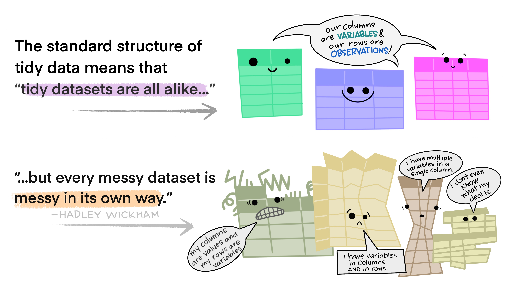

name: intro
class: inverse, middle, center

# Importazione

### Tipi di file


```{r setup, include=FALSE}
knitr::opts_chunk$set(
  fig.retina = 3,
  warning = FALSE,
  message = FALSE,
  comment = ""
)
```

```{r xaringan-themer, include=FALSE, warning=FALSE}
library(xaringanthemer)
red <- "#f34213"
purple <- "#3e2f5b"
orange <- "#ff8811"
green <- "#136f63"
white <- "#FFFFFF"

pastel_orange <- "#F97B64"
blu_gray <- "#1F4257"

style_duo_accent(
    # primary_color = pastel_orange
    # secondary_color = purple,
    colors = c(
        red = red,
        purple = purple,
        orange = orange,
        green = green,
        white = white,
        pastel_orange = pastel_orange,
        blu_gray = blu_gray
    )
)
```

```{r xaringanExtra, include=FALSE}
xaringanExtra::use_xaringan_extra(c(
  "tileview",
  "animate_css",
  "tachyons",
  "editable",
  "panelset",
  "webcam",
  "clipboard",
  "freezeframe",
  "share_again"
))
```

```{r countdown, echo = FALSE, include = FALSE}
library(countdown)
# countdown(minutes = 0, seconds = 15)
```


---
name: struttura

## Ipotesi

- Dati rettangolari

  - ogni riga e ogni colonna hanno lo stesso numero di celle
  - ... allineate in una tabella

--

- Prassi clinica

  - Informazioni (dette anche variabili, o _features_) disposte per colonna
  - Intestazioni delle colonne nominano le informazioni sottostanti
  - Osservazioni (come informazioni su pazienti, dispositivi, o rilevazioni) disposte per riga

.center[
```{r, echo=FALSE, out.width = "50%", fig.cap="Figure from https://github.com/allisonhorst/stats-illustrations"}

```
]

---
name: formati

## Formati comuni

.panelset[
  .panel[.panel-name[`CSV`]
  _Comma-Separated Value_: valori separati da virgola
  
  - testo puro (creabile/leggibile con qualsiasi editor di testo)
  - un file codifica una (singola) tabella
  - ogni riga del file è una riga della tabella
  - ogni virgola nel file indica il limite di una colonna

  - possiamo importarlo in `r fontawesome::fa("r-project", fill = "orange")` con
    ```{r eval = FALSE}
    library(tidyverse) #<<
    
    db <- read_csv("<path/to/file.csv>")
    ```
  
  ]
  .panel[.panel-name[`CSV2`]
  _Comma-Separated Value_ (variante europea): valori separati da **punto-e-virgola**
  
  > ha sempre estensione `.csv`!!

  - delimitatore decimale: `,` (la virgola!)
  - delimitatore di colonna: `;` (punto-e-virgola!)

  - possiamo importarlo in `r fontawesome::fa("r-project", fill = "blue")` con
    ```{r eval = FALSE}
    library(tidyverse) #<<
    
    db <- read_csv2("<path/to/file.csv>")
    ```
  

  ]
  .panel[.panel-name[`XLSX`]
  _Excel_ file (vecchio formato `.xls`)
  
  - file proprietario *NON* testo puro (apribile solo con _Excel_ o software dedicati ad aprire tali formati di file)
  - foglio di calcolo tabellare
  - adattato per comodità e immediatezza a raccogliere dati
  
  - possiamo importarlo in `r fontawesome::fa("r-project", fill = "purple")` con
    ```{r, eval = FALSE}
    library(tidyverse)
    library(readxl) #<<
    
    db_xls <- read_xls("<path/to/file.xls>")
    db_xls_guessed <- read_excel("<path/to/file.xls>") #<<
    identical(db_xls, db_xls_guessed)
    
    db_xlsx <- read_xlsx("<path/to/file.xlsx>")
    db_xlsx_guessed <- read_excel("<path/to/file.xlsx>")  #<<
    identical(db_xlsx, db_xlsx_guessed)
    ```

  ]
]


---

name: tipi

.center[
```{r, echo=FALSE, out.width = "100%", fig.cap="Figure from https://github.com/allisonhorst/stats-illustrations"}
knitr::include_graphics("../images/tidydata_1.jpg")
```
]

--

<br>
<br>

> Non è ottimale per insere dati è normale aspettarsi dati NON-tidy!
> (ciascuno a modo suo...)

---

name: missing


## Dati mancanti


.pull-left[
 #### Nei dati originali
 
 - `-`
 - ""
 - " "
 - NA
 - none
 - missing
 - -1
 - -99
 - -999
 - `"<unknown>"`
 
]
.pull-right[
#### In `r fontawesome::fa("r-project", fill = "gray")`

 - `NA`
 - `NA`
 - `NA`
 - `NA`
 - `NA`
 - `NA`
 - `NA`
 - `NA`
 - `NA`
 - `NA`

]


```{r, eval = FALSE}
library(tidyverse)
library(readxl)

db <- read_excel("<path/to/file.xlsx>", na = c("", "-")) #<<
```

--

.left[
> Mancanza di informazione (`NA`) $\neq$ (`"NA"`) informazione di mancanza


I dati mancanti (di entrambi i tipi) restano **dati**, e richiedono una codifica uniforme

]

---

name: you-1
class: center middle inverse

# Tocca a te

.left[
Se tra le celle di un file Excel troviamo sia campi vuoti che alcuni riempiti con il simbolo "`-`", cosa (se) dobbiamo passare all'argomento riportato qui sotto con `___` per fare in modo che entrambi vengano correttamente importati come `NA`?

```{r, eval = FALSE}
library(tidyverse)
library(readxl)

db <- read_excel("<path/to/file.xlsx>", na = ___)
```

.pull-left[

A. Nulla, va bene il/i valore/i di default

B. `c("-")`

]

.pull-right[

C. `c("", "-")`

D. `NA`

]
]
.right[
```{r, echo = FALSE}
countdown(minutes = 0, seconds = 30)
```
]


---
names: empties

## Colone e righe vuote

Primo passo per ottenere una _tabella di dati_ è eliminare quanto non la rende una tabella: righe o colonne completamente vuote:

```{r, eval = FALSE}
library(tidyverse)
library(readxl)
library(janitor) #<<

db <- read_excel("<path/to/file.xlsx>", na = c("", "-"))
db_full <- remove_empty(db) #<<
```

<br>
<br>
<br>
<br>

> Puoi usare l'opzione `which = "rows"` (oppure `which = "cols"`) per rimuovere selettivamente solo le righe (oppure solo le colonne) completamente vuote
---

name: you-2
class: center middle inverse

# Tocca a te

.left[
Per eliminare le righe completamente vuote da una base di dati, come puoi procedere sfruttando le funzioni del pacchetto `{janitor}`?

.pull-left[

A. 
```{r eval = FALSE}
remove_empty(db)
```

B. 
```{r eval = FALSE}
read_excel("<path/to/db.xlsx>",
  na.rm = remove_empty(
    which = "rows"
  )
)
```

]

.pull-right[

C. 
```{r eval = FALSE}
remove_empty(db, which = "rows")
```

D. 
```{r eval = FALSE}
remove_empty(db, which = "cols")
```

]
]
.right[
```{r, echo = FALSE}
countdown(minutes = 0, seconds = 30)
```
]


---
names: varnames

class: middle center

```{r, echo=FALSE, out.width = "100%", fig.cap="Figure from https://github.com/allisonhorst/stats-illustrations"}
knitr::include_graphics("../images/coding_cases.png")
```

---
names: janitor

.center[
```{r, echo=FALSE, out.width = "70%", fig.cap="Figure from https://github.com/allisonhorst/stats-illustrations"}
knitr::include_graphics("../images/janitor_clean_names.png")
```
]

.pull-left[
```{r, eval = FALSE}
library(tidyverse)
library(readxl)
library(janitor) #<<

db <- read_excel(
  "<path/to/file.xlsx>",
  na = c("", "-")
)
db_full <- remove_empty(db)

db_names <- clean_names(db_full) #<<
```
]

.pull-right[
#### Stili disponbibili (argomento `case`)

- snake_case: "snake" (**DEFAULT**)
- lowerCamel: "lower_camel" or "small_camel"
- UpperCamel: "upper_camel" or "big_camel"
- ALL_CAPS: "all_caps" or "screaming_snake"
- lowerUPPER: "lower_upper"
- UPPERlower: "upper_lower"
- Sentence case: "sentence"
]

---


name: you-3
class: center middle inverse

# Tocca a te

.left[
Come è necessario chiamare la funzione `clean_names` del pacchetto `{janitor}` per convertire tutti i nomi delle variabili di una base di dati con la notazione _snake case_?

.pull-left[

A. `clean_names(db, case = "snake_case")`

B. `clean_names(db, case = "lower_camel")`

]

.pull-right[

C. `clean_names(db)`

D. `read_excel("<path/to/db.xlsx>", var_name = clean_names())`

]
]
.right[
```{r, echo = FALSE}
countdown(minutes = 0, seconds = 30)
```
]

---

name: here

class: middle center

```{r, echo=FALSE, out.width = "80%", fig.cap="Figure from https://github.com/allisonhorst/stats-illustrations"}
knitr::include_graphics("../images/here.png")
```


---

name: here-2

## Pacchetto {here} & RStudio `.rproj` 

```{r}
library(here)

getwd()
here()
here("slides/02-importazione.Rmd")
```

.center[
```{r, echo=FALSE, out.width = "30%", fig.cap="Figure from https://github.com/allisonhorst/stats-illustrations"}
knitr::include_graphics("../images/cracked_setwd.png")
```
]

---
names: here-3

## {here} in azione


```{r, eval = FALSE}
library(here) #<<
library(tidyverse)
library(readxl)
library(janitor)

xlsx_path <- here("<path/from/.rproj/root/to/file.xlsx>") #<<
db <- read_excel(xlsx_path, na = c("", "-")) #<<
db_full <- remove_empty(db)
db_cleaned_names <- clean_names(db_full)
```


---

name: me
class: center middle inverse


# Vediamolo tutto dal vivo!

`02_ex-importazione.R`


---
name: next
class: inverse, middle, center

# Importazione

### Fine.

### Prossimo argomento: [Espressioni regolari](03-regexp.html) 
