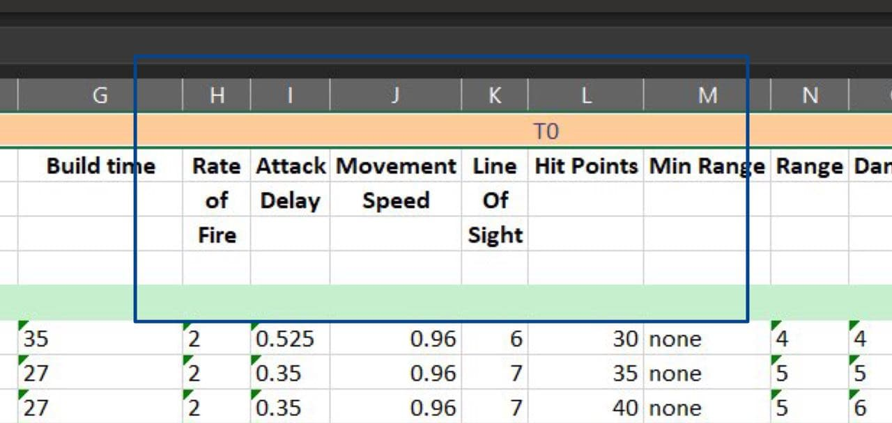

name: unheadr-intro
class: inverse, middle, center

# {unheadr}

### Tipi di metadati


```{r setup, include=FALSE}
knitr::opts_chunk$set(
  fig.retina = 3,
  warning = FALSE,
  message = FALSE,
  comment = ""
)
```

```{r xaringan-themer, include=FALSE, warning=FALSE}
library(xaringanthemer)
red <- "#f34213"
purple <- "#3e2f5b"
orange <- "#ff8811"
green <- "#136f63"
white <- "#FFFFFF"

pastel_orange <- "#F97B64"
blu_gray <- "#1F4257"

style_duo_accent(
    # primary_color = pastel_orange
    # secondary_color = purple,
    colors = c(
        red = red,
        purple = purple,
        orange = orange,
        green = green,
        white = white,
        pastel_orange = pastel_orange,
        blu_gray = blu_gray
    )
)
```

```{r xaringanExtra, include=FALSE}
xaringanExtra::use_xaringan_extra(c(
  "tileview",
  "animate_css",
  "tachyons",
  "editable",
  "panelset",
  "webcam",
  "clipboard",
  "freezeframe",
  "share_again"
))
```

```{r countdown, echo = FALSE, include = FALSE}
library(countdown)
# countdown(minutes = 0, seconds = 15)
```

---
name: overview

## Metadati

.pull-left[
- nomi delle colonne
- disposizione di celle multiple di una medesima informazione (es: **nomi colonne su più righe**)
- raggruppamenti tra le colonne (es: **tempi di raccolta delle medesime variabili**)

<br>

- raggruppamenti tra le righe (es: **separazione dei pazienti in categorie**)
]

.pull-right[.center[
```{r, echo=FALSE, out.width = "80%"}

```

```{r, echo=FALSE, out.width = "80%"}
knitr::include_graphics("../images/messy_groups.jpg")
```
]]


---

name: intestazioni

## Intestazioni

- Pieno controllo delle intestazioni --> rendiamole **_dati_**!!
```{r, eval = FALSE}
library(tidyverse)
library(readxl)

read_excel(<...>,
   col_names = FALSE #<<
)
```


---
name: mash

## {unheadr} Intestazioni raggruppate e frammentate

- `mash_colnames`:
  - numero di righe da unire (`n_name_rows`)
  - inclusione o meno delle intestazioni originali (`keep_names = TRUE`)
  - Ripristino struttura tabellare prima riga di "raggruppamento" (`sliding_headers = FALSE`)

.center[
```{r, echo=FALSE, out.width = "80%"}

```
]


---

name: me
class: center middle inverse


# Vediamolo dal vivo!

`04_ex-unheadr-headers.R`


---
name: unbreak

## {unheadr} valori spezzati

- `unbreak_vals`:
  - un valore su due celle consecutive della stessa colonna (**`ogcol`**)
  - match con la parte finale del/i valore/i spazzato/i (**`regex`**)
  - necessario assegnare un nuovo nome alla colonna!! (**`newcol`**)
  - Unisce i valori di quella colonna (**`sep = " "`**) tutto il resto della riga è (comunque considerata) `NA`

- `unbreak_rows`:
  - una riga "doppia" con i campi riportati su celle consecutive delle stesse colonne (**`ogcol`**)
  - match con la parte iniziale del/i valore/i spazzato/i (**regex**)
  - è sufficiente presentare una sola colonna utile a stabilire da quali righe partire
  - la riga viene "unita" a quella sottostante (**`sep = " "`**)

.center[
```{r, echo=FALSE, out.width = "80%"}
knitr::include_graphics("../images/messy_groups.jpg")
```
]

---

## Argomenti `unbreak_*` 

> - `regex`: espressione regolare per trovare le righe di riferimento da "unire"

> - `ogcol`: colonna originale di riferimento

> - `newcol`: **solo per valori di una sola variabile**, nome della nuova variabile

> - `sep = " " `: separatore tra i valori uniti

---

name: you
class: center middle inverse

# Tocca a te

.left[

.pull-left[
Come importeresti il seguente dataset `test.xlsx`?
]
.pull-right[
```{r, echo = FALSE, comment = ""}
library(tibble)
knitr::kable(tribble(
    ~ID,       ~Peso, ~Altezza,
    "",     "(KG)", "(KG)",
     "1",       "70",    "170",
     "2",       "80",    "180",
))
```
]

.pull-left[

A.

`read_xlsx("test.xlsx") |> mash_colnames(1)`

B.

`read_xlsx("test.xlsx") |> mash_colnames(2)`

]

.pull-right[

C.

`read_xlsx("test.xlsx") |> unbreak_vals("\\(", B) |> unbreak_vals("\\(", C)`

D. 

`read_xlsx("test.xlsx", skip=1)`

<br>
<br>
<br>
<br>
]
]


.right[
```{r, echo = FALSE}
countdown(minutes = 0, seconds = 30)
```
]


---

name: me
class: center middle inverse


# Vediamolo da vivo!

`04_ex-unheadr-mash.R` ("mash")


---

name: you-2
class: center middle inverse

# Tocca a te

.left[

.pull-left[
Come possiamo riattaccare i valori "very" e "bed" nella seguente tabella (ipotizzando sia memorizzata in una variabile `df`)?
]
.pull-rigth[
```{r, echo = FALSE, comment = ""}
library(tibble)
knitr::kable(tribble(
    ~A,     ~B,
     "good", 1,
     "bad",  2,
     "very", 3,
     "bad",  NA
))
```
]

.pull-left[

A.

`unbreak_rows(df, "very", "A")`

B.

`unbreak_rows(df, "very", A)`

]

.pull-right[

C.

`unbreak_rows(df, "bad", A)`

D. 

`unbreak_vals(df, "bad", A, AA)`
<br>
<br>
<br>
<br>

]
]


.right[
```{r, echo = FALSE}
countdown(minutes = 0, seconds = 30)
```
]

---

name: you-3
class: center middle inverse

# Tocca a te

.left[

.pull-left[
Come possiamo riattaccare i valori delle misure con le loro unità (ipotizzando sia memorizzata in una variabile `df`)?
]

.pull-right[
```{r, echo = FALSE, comment = ""}
library(tibble)
knitr::kable(tribble(
    ~ID,     ~Peso, ~Altezza,
     1,       "70",    "170",
     NA,      "kg",    "cm",
     2,       "80",    "180",
     NA,      "kg",    "cm"
))
```
]

.pull-left[

A.

`unbreak_vals(df, "^[a-z]", Peso, Peso_fixed)`

B.

`unbreak_rows(df, "^[0-9]", Peso)`

]

.pull-right[

C.

`unbreak_rows(df, "^[a-z]", Peso)`

D. 

`unbreak_rows(df, "kg", "Peso")`
<br>
<br>
<br>
<br>

]
]


.right[
```{r, echo = FALSE}
countdown(minutes = 0, seconds = 30)
```
]


---

name: you-4
class: center middle inverse

# Tocca a te

.left[

.pull-left[
Come possiamo riattaccare i valori dei pazienti con i loro ID (ipotizzando sia memorizzata in una variabile `df`)?
]

.pull-right[
```{r, echo = FALSE, comment = ""}
library(tibble)
knitr::kable(tribble(
    ~ID,     ~Peso, ~Altezza,
    "1a",       "70",    "170",
    "(Judy)",      NA,    NA,
    "b2",       "80",    "180",
    "(Mark)",      NA,    NA,
    "3c (jade)",       "90",    "190",
))
```
]

.pull-left[

A.

`unbreak_vals(df, "^\\(", ID, id_name)`

B.

`unbreak_vals(df, "^[a-zA-Z0-9]", ID, id_name)`

]

.pull-right[

C.

`unbreak_rows(df, "^[a-zA-Z0-9]", ID)`

D. 

`unbreak_vals(df, "^[a-zA-Z]", ID, id_name)`
<br>
<br>
<br>
<br>
<br>

]
]


.right[
```{r, echo = FALSE}
countdown(minutes = 0, seconds = 30)
```
]


---

name: me
class: center middle inverse


# Vediamolo da vivo!

`04_ex-unheadr-mash.R` ("unbreak")


---
name: groups

## {unheadr} valori raggruppati

Presenti in una colonna le categorie di raggruppamento dei pazienti (es.
Trattamento e Controllo)

- `untangle2`:
  - identifichiamo i gruppi con una espressione regolare (**`regex`**)
  - identifichiamo la colonna in cui troviamo i gruppi (**`orig`**)
  - definiamo il nome della colonna in cui metteremo i gruppi (**`new`**)


.pull-left[
```{r, echo=FALSE, out.width = "80%"}
knitr::include_graphics("../images/messy_groups.jpg")
```
]

--

.pull-right[
> Tutti gli altri valori della riga vengono scartati

> Ricordiamo le "alternative" esplicite formate con `|`
]


---
name: you-5
class: center middle inverse

# Tocca a te

.left[

.pull-left[
Come possiamo rendere espliciti i raggruppamenti effettuati tra i dati della seguente tabella (ipotizzando sia memorizzata in una variabile `df`)?
]

.pull-right[
```{r, echo = FALSE, comment = ""}
library(tibble)
knitr::kable(tribble(
    ~ID,     ~Peso, ~Altezza,
    "Placebo",       NA,    NA,
    "1",       "60",    "160",
    "2",       "70",    "170",
    "Trattamento",       NA,    NA,
    "1",       "80",    "180",
    "2",       "90",    "190"
))
```
]

.pull-left[

A.

`unbreak_rows(df, "Placebo|Trattamento", ID)`

B.

`unbreak_vals(df, "Placebo|Trattamento", ID, Braccio)`

]

.pull-right[

C.

`untangle2(df, "^[^0-9]", ID, "Braccio")`

D. 
`untangle2(df, "^[0-9]", ID, "Braccio")`

<br>
<br>
<br>
<br>
<br>
<br>
<br>

]
]


.right[
```{r, echo = FALSE}
countdown(minutes = 0, seconds = 30)
```
]


---
name: unheadr-next
class: inverse, middle, center

# {unheadr}

### Fine.

### Prossimo argomento: [Tidy data](05-tidy.html) 
