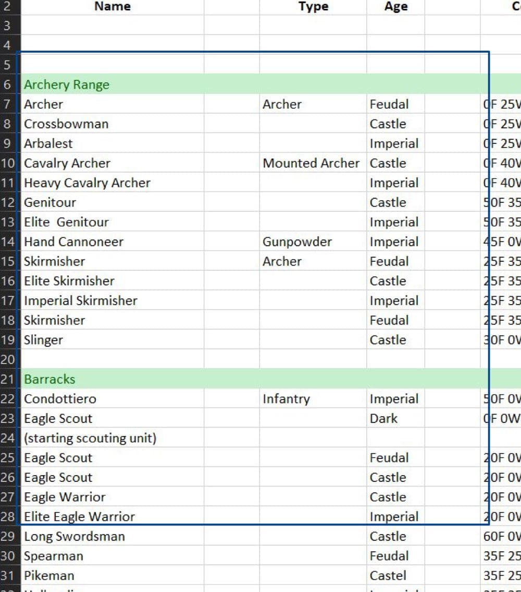

name: tidy-intro
class: inverse, middle, center

# Tidy data

### Facciamo ordine!


```{r setup, include=FALSE}
knitr::opts_chunk$set(
  fig.retina = 3,
  warning = FALSE,
  message = FALSE,
  comment = ""
)
```

```{r xaringan-themer, include=FALSE, warning=FALSE}
library(xaringanthemer)
red <- "#f34213"
purple <- "#3e2f5b"
orange <- "#ff8811"
green <- "#136f63"
white <- "#FFFFFF"

pastel_orange <- "#F97B64"
blu_gray <- "#1F4257"

style_duo_accent(
    # primary_color = pastel_orange
    # secondary_color = purple,
    colors = c(
        red = red,
        purple = purple,
        orange = orange,
        green = green,
        white = white,
        pastel_orange = pastel_orange,
        blu_gray = blu_gray
    )
)
```

```{r xaringanExtra, include=FALSE}
xaringanExtra::use_xaringan_extra(c(
  "tileview",
  "animate_css",
  "tachyons",
  "editable",
  "panelset",
  "webcam",
  "clipboard",
  "freezeframe",
  "share_again"
))
```

```{r countdown, echo = FALSE, include = FALSE}
library(countdown)
# countdown(minutes = 0, seconds = 15)
```

---

name: impliciti


## Dati impliciti

> Spazi vuoti per evitare ripetizioni identiche

- **utile** per inserimento, visualizzazione e comprensione
- ... ma non possiamo analizzare un dato che non c'è


.center[
```{r, echo=FALSE, out.width = "80%"}

```
]


---
name: fill

## Dati mancanti


Dal pacchetto `{tidyr}` (incluso nel Tidyverse) prendiamo

- `fill`: **riempimento a partire da valori noti impliciti**
  1. passiamo la base di dati (**`data`**)
  2. identifichiamo la/e colonna/e di interesse (**`...`**)
  3. opzionalmente selezioniamo la direzione di riempimento (default verso il basso)

.pull-left[
```{r, eval=FALSE}
library(tidyverse)

df <- tribble(
  ~id, ~group, ~times,
   1, "A", 2,
   2, NA, NA, #<<
   3, "B", 3,
   4, NA, 2  #<<
)


df |> 
  fill(group) #<<
```

]


.pull-right[
```{r, echo=FALSE}
library(tidyverse)

df <- tribble(
  ~id, ~group, ~times,
   1, "A", 2,
   2, NA, NA, #<<
   3, "B", 3,
   4, NA, 2  #<<
)


df |> 
  fill(group) #<<
```

]


---
name: fill

## Dati mancanti


Dal pacchetto `{tidyr}` (incluso nel Tidyverse) prendiamo


- `replace_na`: controllo fine su cosa usare per sostituire gli `NA` in una data sequenza
  1. passiamo la sequenza (**non una base di dati**) (**`data`**)
  2. passiamo il valore (singolo) da sostituire al posto degli `NA` trovati (**replace**)


.pull-left[
```{r, eval=FALSE}
library(tidyverse)

df <- tribble(
  ~id, ~group, ~times,
   1, "A", 2,
   2, NA, NA,  #<<
   3, "B", 3,
   4, NA, 2
)

df |> 
  mutate(
    times = replace_na(times, 0) #<<
  )
```
]

.pull-right[
```{r, echo=FALSE}
library(tidyverse)

df <- tribble(
  ~id, ~group, ~times,
   1, "A", 2,
   2, NA, NA,  #<<
   3, "B", 3,
   4, NA, 2
)

df |> 
  mutate(
    times = replace_na(times, 0) #<<
  )
```
]


---

name: you
class: center middle inverse

# Tocca a te

.left[

.pull-left[
Come completeresti il seguente database (ipotizzando sia memorizzata in una variabile `df`)?
]
.pull-right[
```{r, echo = FALSE, comment = ""}
library(tibble)
knitr::kable(tribble(
    ~ID,     ~Peso, ~Altezza,  ~Arm, ~Armid,
    "1",       "60",    "160", "Placebo",1,
    "2",       "70",    "170", NA,1,
    "3",       "80",    "180", NA,1,
    "1",       "90",    "190", "Trattamento",2,
    "2",       "100",    "200", NA,2,
    "3",       "110",    "210", NA,2
))
```
]

.pull-left[

A.

`fill(df, Arm)`

B.

`replace_na(df, Arm, lead(Arm))`

]

.pull-right[

C.

`df |> mutate(Arm = replace_na(Arm, lead(Arm)))`

D. 

`df |> with_groups(Arm, mutate, Arm = Arm[[1]])`

<br>
<br>
<br>
<br>
]
]


.right[
```{r, echo = FALSE}
countdown(minutes = 0, seconds = 30)
```
]


---

name: separazione

## Valori multipli nella stessa colonna

Possiamo trovare valori molteplici nella medesima colonna


---

name: allungamento

---

name: contrazione


---

name: me
class: center middle inverse


# Vediamolo da vivo!

< script >

---

name: you
class: center middle inverse

# Tocca a te

< quiz >

.right[
```{r, echo = FALSE}
countdown(minutes = 1, seconds = 0)
```
]


---
name: tidy-next
class: inverse, middle, center

# Tidy data

### Fine.

### Prossimo argomento: [numeri](06-numeri.html) 
